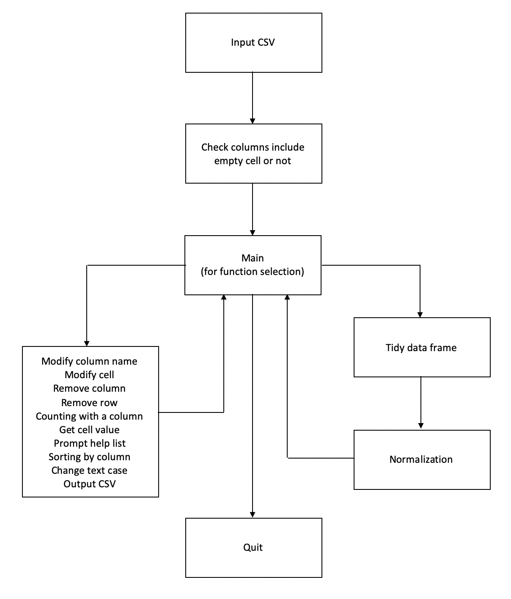

# Data Cleaning Normalization
- [Data Cleaning Normalization](#datacleaningnormalization)
    - [Requirement](#requirement)
    - [Usage](#usage)
        - [Input CSV](#input-csv)
        - [Check Empty Values](#check-empty-values)
        - [Tidy Dataframe](#tidy-dataframe)
        - [Normalization](#normalization)
    - [Options](#options)
        - [Modify Column Title](#modify-column-title)
        - [Modify cell](#modify-cell)
        - [Count Values in Selected Column](#count-values-in-selected-column)
        - [Delete Selected Column](#delete-selected-column)
        - [Delete Selected Row](#delete-selected-row)
        - [Call a Cell Value](#call-a-cell-value)
        - [Output CSV](#output-csv)
        - [Change Text Case](#change-text-case)
        - [Sorting](#sorting)
        - [Quit](#quit)
    - [Help List](#helplist)
    - [Appendix](#appendix)

# Requirement
This script requires `pandas`, `numpy` and `re` library to run, you need to install to run successfully.
```bash
pip3 install pandas
```

# Usage
The program is processing data cleaning. It will detect any spaces and empty values, then transform to first normal formal from normalization. After that user can reproduce a cleaned version of CSV file.
```bash
python3 ch4_individual_ex.py
```

## Input CSV
First input CSV for processing.
`CSV name` in current folder with program or `absolute path` is accessable.
```bash
Input CSV file (staff_dir.csv): staff_dir.csv
```
Input parameter is `raw_data`. Try except is used to prevend `No file or directory` error.
User can terminate the program by typing `\q`.
Error will be printed and the program will force user to input correct file or directory again.
This function will return parameter `raw_data` to create dataframe.
```py
raw_data = None
def input_csv(raw_data):
    try:
        csv_file = input("Input CSV file (staff_dir.csv): ")
        if csv_file == '\q': exit()
        raw_data = pd.read_csv(csv_file)
    except Exception as e:
        print(e)
        return input_csv(raw_data)
    else:
        return raw_data

raw_data = input_csv(raw_data)
df = pd.DataFrame(raw_data)
```
## Check Empty Values
Then the program will look for empty values.
```py
def check_columns_with_empty_cell():
    global df
    global empty_cols

    df.columns = [' '.join(i.split()) for i in df.columns]
    empty_cols_name = [value for value in df.columns if "Unnamed" in value]
    empty_cols = [col for col in df.columns if df[col].isnull().any()]
    print("You have", len(empty_cols_name), "columns without naming")
    print("You have", len(empty_cols), "columns with empty cells")

    return main()
```

## Tidy Dataframe
To delete all excessing spaces and replace data to `Title` textcase, use `-r` to start processing.
```py
def tidy_dataframe():
    global df
    global column_with_multi_values

    print("Diminish spaces and title values")

    for col in list(df.columns):
        for row in range(0, len(df)):
            cell_value = df[col][row]
            if type(cell_value) == np.int64:
                cell_value = str(cell_value.item())
            cell_value_list = list(map(str, cell_value.split("\r\n")))
            if len(cell_value_list) > 1:
                if not col in column_with_multi_values:
                    column_with_multi_values.append(col)

    column_with_single_value = [i for i in df.columns if i not in column_with_multi_values]

    for i in column_with_single_value:
        # print(type(df[i][0]) == str)
        if 'Phone' in i:
            # df[i] = [i.replace("-", "") for i in df[i]]
            df[i] = [re.sub(r"\b-\b", "", i) for i in df[i]]
        else:
            df[i] = [' '.join(i.split()).title() for i in df[i]]

    for i in column_with_multi_values:
        df[i] = [i.replace("\r\n(", "(") for i in df[i]]

    return normalization(column_with_multi_values)
```

## Normalization
Then the program will normalize dataframe to 1st normal form automedically.
```py
def normalization(column_with_multi_values):
    global df
    print("NORMALIZATION")

    for i in range(0, len(column_with_multi_values)):
        selected_column = list(column_with_multi_values[i].split(" "))
        set_index_list = [i for i in df.columns if i not in selected_column]
        df = df.set_index(set_index_list)
        df = df.apply(lambda x: df[column_with_multi_values[i]].str.split('\r\n').explode())
        df = df.reset_index()

    for i in column_with_multi_values:
        # print(type(df[i][0]) == str)
        if 'E-mail' in i:
            df[i] = [' '.join(i.split()).lower() for i in df[i]]
        if 'Location' in i:
            df[i] = [''.join(i.split()).upper() for i in df[i]]
        elif 'Position' in i:
            df[i] = [' '.join(i.split()).title() for i in df[i]]
            df[i] = [i.replace("Assoc.", "Associate") for i in df[i]]
            df[i] = [re.sub(r"\bProf\b", "Professor", i) for i in df[i]]

    duplicateDFRow = df[df.duplicated()]
    print('Duplicated Rows: \n', duplicateDFRow)
    df = df.drop_duplicates()
    df.reset_index(inplace=True)
    del df['index']

    return main()
```

# Options
Usage of options

## Modify Column Title
To modify a title in a selected column, use `-M` to change the string.
```py
def modify_column_name():
    global df

    print(df.columns.values)
    col = input("Name of col that you want to rename: ")
    if col not in df.columns.values: return modify_column_name()
    i = input("Updated name: ")
    df = df.rename(columns={col: i})

    return main()
 ```

## Modify cell
To modify a value in a selected cell, use `-m` to change the string.
```py
def modify_cell():
    global df
    print("Input row, column and value to the cell that you want to change")
    print(df.head(5))
    row = input("Number of Row: ")
    col = input("Name of Column: ")
    if col not in df.columns.values or not row.isnumeric(): return modify_cell()
    value = input("Value: ")
    row = int(row)
    if row > len(df) - 1: return modify_cell()

    df.iloc[row, df.columns.get_loc(col)] = value
    return main()
 ```

## Count Values in Selected Column
To count the number of values in a specific column, use `-C`.
```py
def counting_with_a_column():
    global df
    print(df.columns.values)
    col = input("What columns you want to count? ")
    if col not in df.columns.values: return counting_with_a_column()
    selected_column = [i for i in df[col]]
    selected_column = {i: selected_column.count(i) for i in selected_column}
    for key, value in selected_column.items():
        print(key, value)
    return main()
```

## Delete Selected Column
Use `-D` to delete a selected column.
```py
def remove_selected_column():
    global df

    print(df.head(5))
    i = input("Type order number to select column you want to delete(-a for all): ")
    if i not in df.columns.values:
        return remove_selected_column()
    else:
        del df[i]

    return main()
```

## Delete Selected Row
Use `-d` to delete a selected row.
```py
def remove_selected_row():
    global df
    print(df.head(5))
    row = input("Which rows you want to remove? ")
    if not row.isnumeric(): return remove_selected_row()
    row = int(row)
    if row > len(df) - 1: return remove_selected_row()
    df.drop([row], axis=0, inplace=True)
    return main()
```

## Call a Cell Value
Use `-v` to view the value with a selected cell.
```py
def receive_cell_value():
    row = input("Number of Row: ")
    if not row.isnumeric(): return receive_cell_value()
    row = int(row)
    if row > len(df) - 1: return receive_cell_value()
    col = input("Name of Column: ")
    if col not in df.columns.values: return receive_cell_value()
    print(df.loc[row, col])
    return main()
```

## Output CSV
Use `-o` to specify the name of CSV with directory.
```py
def to_csv():
    global df
    output = input("Name of the new csv file: ")
    df.to_csv(f'{output}.csv', index=0)
    print(f'{output}.csv is generated.')
    main()
```

## Change Text Case
To change the the value to selected textcase within a particular column, use `-t`.
```py
def change_text_case():
    global df

    print(df.columns.values)
    col = input("What columns you want to change? ") 
    if col not in df.columns.values: return change_text_case()
    
    val = input("\'u\' for upper, \'l\' for lower or \'t\' for title: ")    
    if val == 'u': df[col] = [' '.join(i.split()).upper() for i in df[col]]
    elif val == 'l': df[col] = [' '.join(i.split()).lower() for i in df[col]]
    elif val == 't': df[col] = [' '.join(i.split()).title() for i in df[col]]
    else: 
        print('Invalid input!')
        return change_text_case()

    return main()
```

## Sorting
Use `-s` to sort the dataframe by selected column.
```py
def sort_by_column():
    global df

    print(df.columns.values)
    col = input("What columns you want to sort? ") 
    if col not in df.columns.values: return sort_by_column()
    val = input("\'a\' for ascending or \'d\' for descending: ")
    if val == 'd': df = df.sort_values(by=[col], ascending = False)
    elif val == 'a': df = df.sort_values(by=[col], ascending = True)
    else: 
        print('Invalid input!')
        return sort_by_column()
    
    df.reset_index(inplace=True)
    del df['index']

    return main()
```

## Quit
Use `\q` to exit the program.
```py
def quit_prog():
    print("Thank and GoodBye")
    exit()
```

# Help List
The help information is generated based on the information commander already knows about the program. The default help option is `-h,--help`.
```bash
-p,   --print              Print all dataframe           
-C,   --count_column       Count the number of the cell values of a selected column
-m,   --modify_cell        Modify the selected cell value
-M,   --modify_col_name    Modify the selected column name
-D,   --del_col            Remove the selected column    
-d,   --del_row            Remove the selected row       
-v,   --view_value         View the selected cell value  
-o,   --gen_csv            Generate CSV file for database
-s,   --sort               Sort the dataframe by selected column
-t,   --textcase           Change values textcase        
\q,   --quit               Quit the program              
-h,   --help               Show command list
```

# Appendix 

```py
import pandas as pd
import numpy as np
import re

raw_data = None
empty_cols = []
column_with_multi_values = []

def input_csv():
    global raw_data
    try:
        csv_file = input("Input CSV file (staff_dir.csv): ")
        if csv_file == '\q': exit()
        raw_data = pd.read_csv(csv_file)
    except Exception as e:
        print(e)
        return input_csv()
    else:
        return
        
def check_columns_with_empty_cell():
    global df
    global empty_cols

    df.columns = [' '.join(i.split()) for i in df.columns]
    empty_cols_name = [value for value in df.columns if "Unnamed" in value]
    empty_cols = [col for col in df.columns if df[col].isnull().any()]
    print("You have", len(empty_cols_name), "columns without naming")
    print("You have", len(empty_cols), "columns with empty cells")

    return main()


# -M
def modify_column_name():
    global df

    print(df.columns.values)
    col = input("Name of col that you want to rename: ")
    if col not in df.columns.values: return modify_column_name()
    i = input("Updated name: ")
    df = df.rename(columns={col: i})

    return main()


# -m
def modify_cell():
    global df
    print("Input row, column and value to the cell that you want to change")
    print(df.head(5))
    row = input("Number of Row: ")
    col = input("Name of Column: ")
    if col not in df.columns.values or not row.isnumeric(): return modify_cell()
    value = input("Value: ")
    row = int(row)
    if row > len(df) - 1: return modify_cell()

    df.iloc[row, df.columns.get_loc(col)] = value
    return main()


# -D
def remove_selected_column():
    global df

    print(df.head(5))
    i = input("Type order number to select column you want to delete(-a for all): ")
    if i not in df.columns.values:
        return remove_selected_column()
    else:
        del df[i]

    return main()


# -C
def counting_with_a_column():
    global df
    print(df.columns.values)
    col = input("What columns you want to count? ")
    if col not in df.columns.values: return counting_with_a_column()
    selected_column = [i for i in df[col]]
    selected_column = {i: selected_column.count(i) for i in selected_column}
    for key, value in selected_column.items():
        print(key, value)
    return main()


# -d
def remove_selected_row():
    global df
    print(df.head(5))
    row = input("Which rows you want to remove? ")
    if not row.isnumeric(): return remove_selected_row()
    row = int(row)
    if row > len(df) - 1: return remove_selected_row()
    df.drop([row], axis=0, inplace=True)
    return main()


# -r
def tidy_dataframe():
    global df
    global column_with_multi_values

    print("Diminish spaces and title values")

    for col in list(df.columns):
        for row in range(0, len(df)):
            cell_value = df[col][row]
            if type(cell_value) == np.int64:
                cell_value = str(cell_value.item())
            cell_value_list = list(map(str, cell_value.split("\r\n")))
            if len(cell_value_list) > 1:
                if not col in column_with_multi_values:
                    column_with_multi_values.append(col)

    column_with_single_value = [i for i in df.columns if i not in column_with_multi_values]

    for i in column_with_single_value:
        # print(type(df[i][0]) == str)
        if 'Phone' in i:
            # df[i] = [i.replace("-", "") for i in df[i]]
            df[i] = [re.sub(r"\b-\b", "", i) for i in df[i]]
        else:
            df[i] = [' '.join(i.split()).title() for i in df[i]]

    for i in column_with_multi_values:
        df[i] = [i.replace("\r\n(", "(") for i in df[i]]

    return normalization(column_with_multi_values)


def normalization(column_with_multi_values):
    global df
    print("NORMALIZATION")

    for i in range(0, len(column_with_multi_values)):
        selected_column = list(column_with_multi_values[i].split(" "))
        set_index_list = [i for i in df.columns if i not in selected_column]
        df = df.set_index(set_index_list)
        df = df.apply(lambda x: df[column_with_multi_values[i]].str.split('\r\n').explode())
        df = df.reset_index()

    for i in column_with_multi_values:
        # print(type(df[i][0]) == str)
        if 'E-mail' in i:
            df[i] = [' '.join(i.split()).lower() for i in df[i]]
        if 'Location' in i:
            df[i] = [''.join(i.split()).upper() for i in df[i]]
        elif 'Position' in i:
            df[i] = [' '.join(i.split()).title() for i in df[i]]
            df[i] = [i.replace("Assoc.", "Associate") for i in df[i]]
            df[i] = [re.sub(r"\bProf\b", "Professor", i) for i in df[i]]

    duplicateDFRow = df[df.duplicated()]
    print('Duplicated Rows: \n', duplicateDFRow)
    df = df.drop_duplicates()
    df.reset_index(inplace=True)
    del df['index']

    return main()


# -v
def receive_cell_value():
    row = input("Number of Row: ")
    if not row.isnumeric(): return receive_cell_value()
    row = int(row)
    if row > len(df) - 1: return receive_cell_value()
    col = input("Name of Column: ")
    if col not in df.columns.values: return receive_cell_value()
    print(df.loc[row, col])
    return main()


# -o
def to_csv():
    global df
    output = input("Name of the new csv file: ")
    df.to_csv(f'{output}.csv', index=0)
    print(f'{output}.csv is generated.')
    main()

# -s
def sort_by_column():
    global df

    print(df.columns.values)
    col = input("What columns you want to sort? ") 
    if col not in df.columns.values: return sort_by_column()
    val = input("\'a\' for ascending or \'d\' for descending: ")
    if val == 'd': df = df.sort_values(by=[col], ascending = False)
    elif val == 'a': df = df.sort_values(by=[col], ascending = True)
    else: 
        print('Invalid input!')
        return sort_by_column()
    
    df.reset_index(inplace=True)
    del df['index']

    return main()

# -t
def change_text_case():
    global df

    print(df.columns.values)
    col = input("What columns you want to change? ") 
    if col not in df.columns.values: return change_text_case()
    
    val = input("\'u\' for upper, \'l\' for lower or \'t\' for title: ")    
    if val == 'u': df[col] = [' '.join(i.split()).upper() for i in df[col]]
    elif val == 'l': df[col] = [' '.join(i.split()).lower() for i in df[col]]
    elif val == 't': df[col] = [' '.join(i.split()).title() for i in df[col]]
    else: 
        print('Invalid input!')
        return change_text_case()

    return main()

# \q
def quit_prog():
    print("Thank and GoodBye")
    exit()


# -h
def help_list():
    print("\n%-5s %-20s %-30s" % ("-p,", "--print", "Print all dataframe"))
    print("%-5s %-20s %-30s" % ("-C,", "--count_column", "Count the number of the cell values of a selected column"))
    print("%-5s %-20s %-30s" % ("-m,", "--modify_cell", "Modify the selected cell value"))
    print("%-5s %-20s %-30s" % ("-M,", "--modify_col_name", "Modify the selected column name"))
    print("%-5s %-20s %-30s" % ("-D,", "--del_col", "Remove the selected column"))
    print("%-5s %-20s %-30s" % ("-d,", "--del_row", "Remove the selected row"))
    print("%-5s %-20s %-30s" % ("-v,", "--view_value", "View the selected cell value"))
    print("%-5s %-20s %-30s" % ("-o,", "--gen_csv", "Generate CSV file for database"))
    print("%-5s %-20s %-30s" % ("-s,", "--sort", "Sort the dataframe by selected column"))
    print("%-5s %-20s %-30s" % ("-t,", "--textcase", "Change values textcase"))
    print("%-5s %-20s %-30s" % ("\q,", "--quit", "Quit the program"))
    print("%-5s %-20s %-30s" % ("-h,", "--help", "Show command list\n"))

    return main()


def main():
    global df

    usr_input = input('prog ')
    if usr_input == '-p' or usr_input == '--print':
        print(df)
        main()
    elif usr_input == '-C' or usr_input == '--count_column': counting_with_a_column()
    elif usr_input == '-m' or usr_input == '--modify_cell': modify_cell()
    elif usr_input == '-M' or usr_input == '--modify_col_name': modify_column_name()
    elif usr_input == '-D' or usr_input == '--remove_col': remove_selected_column()
    elif usr_input == '-d' or usr_input == '--remove_row': remove_selected_row()
    elif usr_input == '-v' or usr_input == '--view_value': receive_cell_value()
    elif usr_input == '-o' or usr_input == '--gen_csv': to_csv()
    elif usr_input == '-r' or usr_input == '--run': tidy_dataframe()
    elif usr_input == '-s' or usr_input == '--sort': sort_by_column()
    elif usr_input == '-t' or usr_input == '--text_case': change_text_case()
    elif usr_input == '\q' or usr_input == '--quit': quit_prog()
    elif usr_input == '-h' or usr_input == '--help': help_list()
    else:
        print("Invalid input. Please type again.")
        main()


# Start
print("Welcome to the UI! Type '-h' or '--help' to know the command of the program.")
input_csv()
df = pd.DataFrame(raw_data)
check_columns_with_empty_cell()
```