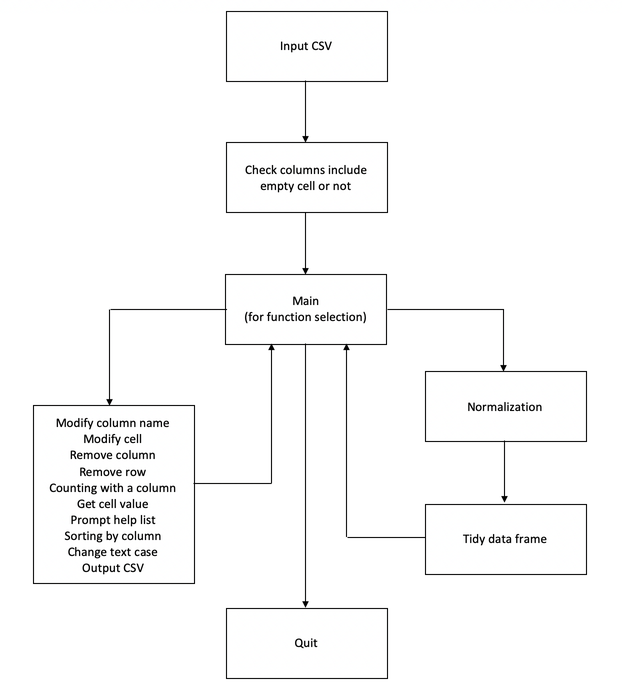

# Data Cleaning Normalization
- [Data Cleaning Normalization](#datacleaningnormalization)
    - [Requirement](#requirement)
    - [Usage](#usage)
        - [Input CSV](#input-csv)
        - [Check Empty Values](#check-empty-values)
        - [Normalization](#normalization)
        - [Tidy Dataframe](#tidy-dataframe)
    - [Options](#options)
        - [Modify Column Title](#modify-column-title)
        - [Modify cell](#modify-cell)
        - [Count Values in Selected Column](#count-values-in-selected-column)
        - [Delete Selected Column](#delete-selected-column)
        - [Delete Selected Row](#delete-selected-row)
        - [Call a Cell Value](#call-a-cell-value)
        - [Output CSV](#output-csv)
        - [Change Text Case](#change-text-case)
        - [Sorting](#sorting)
        - [Quit](#quit)
    - [Help List](#helplist)
    - [Appendix](#appendix)

# Requirement
This script requires `pandas`, `numpy` and `re` library to run, you need to install to run successfully.
```bash
pip3 install pandas
```

# Usage
The program is processing the step of data cleaning. It will detect any spaces and empty values, then transform to first normal formal utilizing normalization. After that user can reproduce a cleaned version of the CSV file.
```bash
python3 ch4_individual_ex.py
```

## Input CSV
First input CSV for processing.
`CSV name` in the current folder with the program or `absolute path` is accessible.
The input parameter is `raw_data`. Try except is used to prevent `No file or directory` error.
User can terminate the program by typing `\q`.
The error will be printed and force the user to input the correct file or directory again.
This function will return the parameter `raw_data` to create dataframe.
```py
raw_data = None
def input_csv(raw_data):
    try:
        csv_file = input("Input CSV file (staff_dir.csv): ")
        if csv_file == '\q': exit()
        raw_data = pd.read_csv(csv_file)
    except Exception as e:
        print(e)
        return input_csv(raw_data)
    else:
        return raw_data

raw_data = input_csv(raw_data)
df = pd.DataFrame(raw_data)
```
Result in console:
```bash
Input CSV file (staff_dir.csv): staff_dir.csv
```

## Check Empty Values
Then the program will look for empty values by calling this function automatically.
It requires a global variable `df`. Firstly, the function will search for any `Unnamed` column name and scan values in each column to find any column is containing empty values.
After that, the conclusion will be shown and it will return to the main function.
```py
check_columns_with_empty_cell(df)

def check_columns_with_empty_cell(df):

    df.columns = [' '.join(i.split()) for i in df.columns]
    empty_cols_name = [value for value in df.columns if "Unnamed" in value]
    empty_cols = [col for col in df.columns if df[col].isnull().any()]
    print("You have", len(empty_cols_name), "columns without naming")
    print("You have", len(empty_cols), "columns with empty cells")

    return main()
```
Result in console:
```bash
You have 0 columns without naming
You have 0 columns with empty cells
prog 
```

## Normalization
Then the program will normalize dataframe to first normal form by using `-r` to start.
Global variable `df` will be used to expend rows containing `\r\n` to ensure each cell only contain one value.
A list `column_with_multi_values` is formed to save columns with multiple values.
Then by setting index without the particular column, use `.explode()` to append the row to perform normalization.
```py
def normalization():
    global df
    column_with_multi_values = []

    for col in list(df.columns):
        df[col] = ['('.join(i.split("\r\n(")) for i in df[col]]
        for row in range(0, len(df)):
            cell_value = df[col][row]
            cell_value_list = list(map(str, cell_value.split("\r\n")))
            if (len(cell_value_list) > 1 and not col in column_with_multi_values): column_with_multi_values.append(col)

    for i in range(0, len(column_with_multi_values)):
        selected_column = list(column_with_multi_values[i].split(" "))
        set_index_list = [i for i in df.columns if i not in selected_column]
        df = df.set_index(set_index_list)
        df = df.apply(lambda x: df[column_with_multi_values[i]].str.split('\r\n').explode())
        df = df.reset_index()

    print("Normalization is complete")
    return tidy_dataframe()
```

## Tidy Dataframe
Later the program will delete all excessing spaces and replace data automatically.
By continuing the `normalization()` function, it will eliminate excessive spaces and change to `title` textcase.
In `Location`, all strings will change to `upper` textcase.
In `Phone`, all special characters will be removed.
In `Position`, all abbreviations will extend to long format.
After that, the index number will be reset to reproduce as row number.
```py
def tidy_dataframe():
    global df

    for i in list(df.columns):
        if 'E-mail' in i: continue
        elif 'Location' in i: df[i] = [''.join(i.split()).upper() for i in df[i]]
        elif 'Phone' in i: df[i] = [re.sub(r"[^A-Za-z0-9]+", "", i) for i in df[i]]
        elif 'Position' in i:
            df[i] = ['('.join(i.split(' (')).title() for i in df[i]]
            df[i] = [i.replace("Assoc.", "Associate") for i in df[i]]
            df[i] = [re.sub(r"\bProf\b", "Professor", i) for i in df[i]]
        else: df[i] = [' '.join(i.split()).title() for i in df[i]]

    duplicateDFRow = df[df.duplicated()]
    print('Duplicated Rows: \n', duplicateDFRow)
    df = df.drop_duplicates()
    df.reset_index(inplace=True)
    del df['index']
    print("Diminish spaces and title values")

    return main()
```
Result in console:
```bash
prog -r
Normalization is complete
Duplicated Rows: 
     Title Surname   Given Name  E-mail Address Phone Number                 Position Location
15  Prof.    Tang  Akaysha Can   actang@hku.hk     25698751                Professor    MW523
16  Prof.    Tang  Akaysha Can   actang@hku.hk     25698751                Professor    MW538
17  Prof.    Tang  Akaysha Can   actang@hku.hk     25698751  Director Of The Nfe Lab    MW523
18  Prof.    Tang  Akaysha Can   actang@hku.hk     25698751  Director Of The Nfe Lab    MW538
24    Dr.     Lai         Chun  laichun@hku.hk     25698761      Associate Professor    MW623
Diminish spaces and title values
prog
```

# Options
Usage of options

## Modify Column Title
To modify a title in a selected column, use `-M` to change the string.
The local variable `col` will be formed by asking the user to type the name of a column that want to change, and `i` will record the changed name.
If else ensure user to input correct column name, otherwise will ask for input again.
User can return to the main function by typing `\q`.
```py
def modify_column_name():
    global df

    print(df.columns.values)
    col = input("Name of column that you want to rename: ")
    if col == '\q': return main()
    elif col not in df.columns.values: return modify_column_name()
    i = input("Updated name: ")
    df = df.rename(columns={col: i})
    print(f'"{col}" is changed to "{i}".')
    return main()
 ```
 Result in console:
 ```bash
prog -M
['Title' 'Surname' 'Given Name' 'Position' 'Location' 'E-mail Address'
 'Phone Number']
Name of column that you want to rename: Title
Updated name: Rename-Title
"Title" is changed to "Rename-Title".
 ```

## Modify cell
To modify a value in a selected cell, use `-m` to change the string.
The local variable `col`, `row` and `value` save user's input to locate the specific cell, then change to the value in `value`.
If else can prevent the user from inputting incorrect column name and row that exceeds the total number of row in the dataframe, and restrict the user to input again.
User can return to the main function by typing `\q`.
```py
def modify_cell():
    global df
    print("Input row, column and value to a cell that you want to change")
    print("Length of dataframe is", len(df) - 1, '\n', df.columns.values)
    row = input("Number of Row: ")
    col = input("Name of Column: ")
    if (col == '\q' or row == '\q'): return main()
    elif col not in df.columns.values or not row.isnumeric(): return modify_cell()
    row = int(row)
    if row > len(df) - 1: return modify_cell()
    value = input("Value: ")

    df.iloc[row, df.columns.get_loc(col)] = value
    print(f'The value of row {row} in "{col}" is changed to "{value}".')

    return main()
 ```
 Result in console:
```bash
prog -m
Input row, column and value to a cell that you want to change
Length of dataframe is 16
 ['Title' 'Surname' 'Given Name' 'Position' 'Location' 'E-mail Address'
 'Phone Number']
Number of Row: 1
Name of Column: Title
Value: Mr.
The value of row 1 in "Title" is changed to "Mr.".
```

## Count Values in Selected Column
To count the number of values in a specific column, use `-C`.
The local variable `col` save the selected column from the user and calculate the number of each value.
If else can prevent the user from inputting incorrect column name, and restrict the user to input again.
Then print in the console.
User can return to the main function by typing `\q`.
```py
def counting_with_a_column():
    global df
    print(df.columns.values)
    col = input("Select a column to count: ")
    if col == '\q': return main()
    elif col not in df.columns.values: return counting_with_a_column()
    selected_column = [i for i in df[col]]
    selected_column = {i: selected_column.count(i) for i in selected_column}
    for key, value in selected_column.items():
        print(key, value)
    return main()
```
Result in console:
```bash
prog -C
['Title' 'Surname' 'Given Name' 'E-mail Address' 'Phone Number' 'Position'
 'Location']
Select a column to count: Title
Prof. 5
Dr. 14
Ms. 2
Mr. 1
```

## Delete Selected Column
Use `-D` to delete a selected column.
The local variable `i` save the name of column from the user to delete.
If else can prevent the user from inputting incorrect column name, and restrict the user to input again.
User can return to the main function by typing `\q`.
```py
def remove_selected_column():
    global df

    print(df.columns.values)
    i = input("Type the name of column to delete: ")
    if i == '\q': return main()
    elif i not in df.columns.values: return remove_selected_column()
    else: del df[i]

    print(f'"{i}" is removed.')

    return main()
```
Result in console:
```bash
prog -D
['Title' 'Surname' 'Given Name' 'Position' 'Location' 'E-mail Address'
 'Phone Number']
Type the name of column to delete: Title
"Title" is removed.
```

## Delete Selected Row
Use `-d` to delete a selected row.
The local variable `row` save the number of row from the user to delete.
If else can prevent the user from inputting incorrect number of row, and restrict the user to input again.
User can return to the main function by typing `\q`.
```py
def remove_selected_row():
    global df
    print(len(df))
    row = input("Number of row to remove: ")
    if row == '\q': return main()
    elif not row.isnumeric(): return remove_selected_row()
    row = int(row)
    if row > len(df) - 1: return remove_selected_row()
    df.drop([row], axis=0, inplace=True)
    print(f'Row {row} is removed.')

    return main()
```
Result in console:
```bash
prog -d
17
Number of row to remove: 4 
Row 4 is removed.
```

## Call a Cell Value
Use `-v` to view the value with a selected cell.
The local variable `row` and `col` save the input from the user to view a cell value.
If else can prevent the user from inputting incorrect number of row and the name of column, and restrict the user to input again.
User can return to the main function by typing `\q`.
```py
def receive_cell_value():
    print('Length of the row is', len(df) - 1)
    row = input("Number of Row: ")
    if row == '\q': return main()
    elif not row.isnumeric(): return receive_cell_value()
    row = int(row)
    if row > len(df) - 1: return receive_cell_value()
    
    print(df.columns.values)
    col = input("Name of Column: ")
    if col == '\q': return main()
    elif col not in df.columns.values: return receive_cell_value()
    print('The value is', df.loc[row, col])

    return main()
```
Result in console:
```bash
prog -v
Length of the row is 16
Number of Row: 4
['Title' 'Surname' 'Given Name' 'Position' 'Location' 'E-mail Address'
 'Phone Number']
Name of Column: Title
The value is Mr.
```

## Output CSV
Use `-o` to specify the name of CSV and form a new CSV file.
The local variable `output` save the name of the new CSV file.
User can return to the main function by typing `\q`.
```py
def to_csv():
    global df
    output = input("Name of the new csv file: ")
    if output == '\q': return main()
    df.to_csv(f'{output}.csv', index=0)
    print(f'{output}.csv is generated.')

    return main()
```
Result in console:
```bash
prog -o
Name of the new csv file: output
output.csv is generated.
```

## Change Text Case
To change the the value to selected textcase within a particular column, use `-t`.
The local variable `col` and `val` save the name of column and selected textcase.
If else can prevent the user from inputting incorrect name of column and type of textcase, and restrict the user to input again.
User can return to the main function by typing `\q`.
```py
def change_text_case():
    global df

    print(df.columns.values)
    col = input("Name of column to change: ") 
    if col == '\q': return main()
    elif col not in df.columns.values: return change_text_case()
    
    val = input("\'up\' for upper, \'lo\' for lower or \'ti\' for title: ")
    if val == '\q': return main()    
    elif val == 'up': df[col] = [' '.join(i.split()).upper() for i in df[col]]
    elif val == 'lo': df[col] = [' '.join(i.split()).lower() for i in df[col]]
    elif val == 'ti': df[col] = [' '.join(i.split()).title() for i in df[col]]
    else: 
        print('Invalid input!')
        return change_text_case()

    print(f'The textcase of "{col}" is changed.')
    return main()
```
Result of console:
```bash
prog -t
['Title' 'Surname' 'Given Name' 'E-mail Address' 'Phone Number' 'Position'
 'Location']
Name of column to change: Title
'up' for upper, 'lo' for lower or 'ti' for title: up
The textcase of "Title" is changed.
```

## Sorting
Use `-s` to sort the dataframe by selected column.
The local variable `col` and `val` save the name of column and selected pattern of sorting.
If else can prevent the user from inputting incorrect name of column and type of pattern, and restrict the user to input again.
User can return to the main function by typing `\q`.
The index will reset to generate new row numbers series.
```py
def sort_by_column():
    global df

    print(df.columns.values)
    col = input("Name of column to sort: ")
    if col == '\q': return main()
    elif col not in df.columns.values: return sort_by_column()
    val = input("\'as\' for ascending or \'de\' for descending: ")
    if val == '\q': return main()
    elif val == 'de': df = df.sort_values(by=[col], ascending = False)
    elif val == 'as': df = df.sort_values(by=[col], ascending = True)
    else: 
        print('Invalid input!')
        return sort_by_column()
    
    df.reset_index(inplace=True)
    del df['index']
    print(f'The order of "{col}" is changed.')
    return main()
```
Result in console:
```bash
prog -s
['Title' 'Surname' 'Given Name' 'E-mail Address' 'Phone Number' 'Position'
 'Location']
Name of column to sort: Surname
'as' for ascending or 'de' for descending: as
The order of "Surname" is changed.
```

## Quit
Use `\q` to exit the program.
```py
def quit_prog():
    print("Thank you and GoodBye")
    exit()
```

# Help List
The help information is generated based on the information commander already knows about the program. The default help option is `-h,--help`.
```bash
-p,   --print              Print all dataframe           
-C,   --count_column       Count the number of the cell values of a selected column
-m,   --modify_cell        Modify the selected cell value
-M,   --modify_col_name    Modify the selected column name
-D,   --del_col            Remove the selected column    
-d,   --del_row            Remove the selected row       
-v,   --view_value         View the selected cell value  
-o,   --gen_csv            Generate CSV file for database
-s,   --sort               Sort the dataframe by selected column
-t,   --textcase           Change values textcase        
\q,   --quit               Quit the program              
-h,   --help               Show command list
```

# Appendix 

```py
import pandas as pd
import numpy as np
import re

raw_data = None
empty_cols = []

def input_csv(raw_data):
    try:
        csv_file = input("Input CSV file (staff_dir.csv): ")
        if csv_file == '\q': exit()
        raw_data = pd.read_csv(csv_file)
    except Exception as e:
        print(e)
        return input_csv(raw_data)
    else:
        return raw_data

def check_columns_with_empty_cell(df, empty_cols):

    df.columns = [' '.join(i.split()) for i in df.columns]
    empty_cols_name = [value for value in df.columns if "Unnamed" in value]
    empty_cols = [col for col in df.columns if df[col].isnull().any()]
    print("You have", len(empty_cols_name), "columns without naming")
    print("You have", len(empty_cols), "columns with empty cells")

    return main()


# -M
def modify_column_name():
    global df

    print(df.columns.values)
    col = input("Name of column that you want to rename: ")
    if col == '\q': return main()
    elif col not in df.columns.values: return modify_column_name()
    i = input("Updated name: ")
    df = df.rename(columns={col: i})
    print(f'"{col}" is changed to "{i}".')
    return main()


# -m
def modify_cell():
    global df
    print("Input row, column and value to a cell that you want to change")
    print("Length of dataframe is", len(df) - 1, '\n', df.columns.values)
    row = input("Number of Row: ")
    col = input("Name of Column: ")
    if (col == '\q' or row == '\q'): return main()
    elif col not in df.columns.values or not row.isnumeric(): return modify_cell()
    row = int(row)
    if row > len(df) - 1: return modify_cell()
    value = input("Value: ")

    df.iloc[row, df.columns.get_loc(col)] = value
    print(f'The value of row {row} in "{col}" is changed to "{value}".')

    return main()


# -D
def remove_selected_column():
    global df

    print(df.columns.values)
    i = input("Type the name of column to delete: ")
    if i == '\q': return main()
    elif i not in df.columns.values: return remove_selected_column()
    else: del df[i]

    print(f'"{i}" is removed.')

    return main()


# -C
def counting_with_a_column():
    global df
    print(df.columns.values)
    col = input("Select a column to count: ")
    if col == '\q': return main()
    elif col not in df.columns.values: return counting_with_a_column()
    selected_column = [i for i in df[col]]
    selected_column = {i: selected_column.count(i) for i in selected_column}
    for key, value in selected_column.items():
        print(key, value)
    return main()


# -d
def remove_selected_row():
    global df
    print(len(df))
    row = input("Number of row to remove: ")
    if row == '\q': return main()
    elif not row.isnumeric(): return remove_selected_row()
    row = int(row)
    if row > len(df) - 1: return remove_selected_row()
    df.drop([row], axis=0, inplace=True)
    print(f'Row {row} is removed.')
    
    return main()


# -r
def normalization():
    global df
    column_with_multi_values = []
    
    for col in list(df.columns):
        df[col] = ['('.join(i.split("\r\n(")) for i in df[col]]
        for row in range(0, len(df)):
            cell_value = df[col][row]
            # if type(cell_value) == np.int64: cell_value = str(cell_value.item())
            cell_value_list = list(map(str, cell_value.split("\r\n")))
            if (len(cell_value_list) > 1 and not col in column_with_multi_values): column_with_multi_values.append(col)

    for i in range(0, len(column_with_multi_values)):
        selected_column = list(column_with_multi_values[i].split(" "))
        set_index_list = [i for i in df.columns if i not in selected_column]
        df = df.set_index(set_index_list)
        df = df.apply(lambda x: df[column_with_multi_values[i]].str.split('\r\n').explode())
        df = df.reset_index()

    print("Normalization is complete")
    return tidy_dataframe()

def tidy_dataframe():
    global df

    for i in list(df.columns):
        # print(type(df[i][0]) == str)
        # df[i] = [i.replace("-", "") for i in df[i]]
        if 'E-mail' in i: continue
        elif 'Location' in i: df[i] = [''.join(i.split()).upper() for i in df[i]]
        elif 'Phone' in i: df[i] = [re.sub(r"[^A-Za-z0-9]+", "", i) for i in df[i]]
        elif 'Position' in i:
            df[i] = ['('.join(i.split(' (')).title() for i in df[i]]
            df[i] = [i.replace("Assoc.", "Associate") for i in df[i]]
            df[i] = [re.sub(r"\bProf\b", "Professor", i) for i in df[i]]
        else: df[i] = [' '.join(i.split()).title() for i in df[i]]

    duplicateDFRow = df[df.duplicated()]
    print('Duplicated Rows: \n', duplicateDFRow)
    df = df.drop_duplicates()
    df.reset_index(inplace=True)
    del df['index']
    print("Diminish spaces and title values")

    return main()

# -v
def receive_cell_value():
    print('Length of the row is', len(df) - 1)
    row = input("Number of Row: ")
    if row == '\q': return main()
    elif not row.isnumeric(): return receive_cell_value()
    row = int(row)
    if row > len(df) - 1: return receive_cell_value()
    
    print(df.columns.values)
    col = input("Name of Column: ")
    if col == '\q': return main()
    elif col not in df.columns.values: return receive_cell_value()
    print('The value is', df.loc[row, col])

    return main()


# -o
def to_csv():
    global df
    output = input("Name of the new csv file: ")
    if output == '\q': return main()
    df.to_csv(f'{output}.csv', index=0)
    print(f'{output}.csv is generated.')
    
    return main()

# -s
def sort_by_column():
    global df

    print(df.columns.values)
    col = input("Name of column to sort: ")
    if col == '\q': return main()
    elif col not in df.columns.values: return sort_by_column()
    val = input("\'as\' for ascending or \'de\' for descending: ")
    if val == '\q': return main()
    elif val == 'de': df = df.sort_values(by=[col], ascending = False)
    elif val == 'as': df = df.sort_values(by=[col], ascending = True)
    else: 
        print('Invalid input!')
        return sort_by_column()
    
    df.reset_index(inplace=True)
    del df['index']
    print(f'The order of "{col}" is changed.')
    return main()

# -t
def change_text_case():
    global df

    print(df.columns.values)
    col = input("Name of column to change: ") 
    if col == '\q': return main()
    elif col not in df.columns.values: return change_text_case()
    
    val = input("\'up\' for upper, \'lo\' for lower or \'ti\' for title: ")
    if val == '\q': return main()    
    elif val == 'up': df[col] = [' '.join(i.split()).upper() for i in df[col]]
    elif val == 'lo': df[col] = [' '.join(i.split()).lower() for i in df[col]]
    elif val == 'ti': df[col] = [' '.join(i.split()).title() for i in df[col]]
    else: 
        print('Invalid input!')
        return change_text_case()

    print(f'The textcase of "{col}" is changed.')
    return main()

# \q
def quit_prog():
    print("Thank you and GoodBye")
    exit()


# -h
def help_list():
    print("\n%-5s %-20s %-30s" % ("-p,", "--print", "Print all dataframe"))
    print("%-5s %-20s %-30s" % ("-C,", "--count_column", "Count the number of the cell values of a selected column"))
    print("%-5s %-20s %-30s" % ("-m,", "--modify_cell", "Modify the selected cell value"))
    print("%-5s %-20s %-30s" % ("-M,", "--modify_col_name", "Modify the selected column name"))
    print("%-5s %-20s %-30s" % ("-D,", "--del_col", "Remove the selected column"))
    print("%-5s %-20s %-30s" % ("-d,", "--del_row", "Remove the selected row"))
    print("%-5s %-20s %-30s" % ("-v,", "--view_value", "View the selected cell value"))
    print("%-5s %-20s %-30s" % ("-o,", "--gen_csv", "Generate CSV file for database"))
    print("%-5s %-20s %-30s" % ("-s,", "--sort", "Sort the dataframe by selected column"))
    print("%-5s %-20s %-30s" % ("-t,", "--textcase", "Change values textcase"))
    print("%-5s %-20s %-30s" % ("\q,", "--quit", "Quit the program"))
    print("%-5s %-20s %-30s" % ("-h,", "--help", "Show command list\n"))

    return main()


def main():
    global df
    usr_input = input('prog ')
    if usr_input == '-p' or usr_input == '--print':
        print(df)
        main()
    elif usr_input == '-C' or usr_input == '--count_column': counting_with_a_column()
    elif usr_input == '-m' or usr_input == '--modify_cell': modify_cell()
    elif usr_input == '-M' or usr_input == '--modify_col_name': modify_column_name()
    elif usr_input == '-D' or usr_input == '--remove_col': remove_selected_column()
    elif usr_input == '-d' or usr_input == '--remove_row': remove_selected_row()
    elif usr_input == '-v' or usr_input == '--view_value': receive_cell_value()
    elif usr_input == '-o' or usr_input == '--gen_csv': to_csv()
    elif usr_input == '-r' or usr_input == '--run': normalization()
    elif usr_input == '-s' or usr_input == '--sort': sort_by_column()
    elif usr_input == '-t' or usr_input == '--text_case': change_text_case()
    elif usr_input == '\q' or usr_input == '--quit': quit_prog()
    elif usr_input == '-h' or usr_input == '--help': help_list()
    else:
        print("Invalid input. Please type again.")
        main()


# Start
print("Welcome to the UI! Type '-h' or '--help' to know the command of the program.")
raw_data = input_csv(raw_data)
df = pd.DataFrame(raw_data)
check_columns_with_empty_cell(df, empty_cols)

```